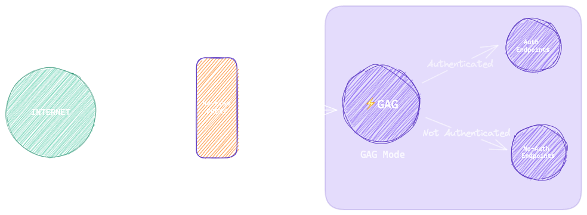
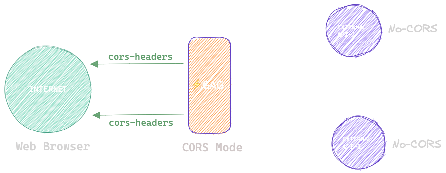

<div align="center">
    
</div>

----
# 🚀High Performance GO API Gateway(GAG) for JWT based Authentication and builtin CORS proxy


Welcome to the Lightning Fast GO API Gateway (GAG) repository, completely written in 🐹**Go**! This repository provides a blazing-fast API gateway solution for managing microservices communication with JWT-based authentication. GAG supports various algorithms for JWT decoding, including RSA, and seamlessly integrates both HTTP and gRPC (Coming soon!) for efficient microservice communication.
<div align="center">
    
</div>
<p align="center"><u>Mode</u> - <b>GAG</b></p>
<div align="center">
    
</div>
<p align="center"><u>Mode</u> - <b>CORS</b></p>

## Use cases

- [x] Rapid Prototype Deployment with Authentication: Utilize the GAG binary to forward requests to your application, accelerating the process of prototype deployment while ensuring secure authentication.

- [x] Overcoming CORS Restrictions: Bypass Cross-Origin Resource Sharing (CORS) limitations that prevent direct API calls to third-party services. With GAG, you can seamlessly interact with APIs regardless of their CORS policies.

- [x] Microservices Routing - In a microservices architecture, use GAG to route requests to the appropriate service based on the request path, method, or other parameters.

- [ ] Rate Limiting - Implement rate limiting with GAG to control the number of requests a client can make to your application within a certain time period, protecting your services from abuse and overuse. ```In Progress```

- [ ] SSL Termination - Utilize GAG to handle incoming SSL connections, decrypt the requests, and distribute them to your internal network. This offloads the SSL decryption task from your application servers, improving overall performance. ```In Progress```

## Table of Contents

1. [Introduction](#introduction)
2. [Installation](#installation)
3. [Current Development](#current-development)
5. [Building and Running](#building-and-running)
4. [Future Work](#future-work)
6. [License](#license)

## Introduction

API gateways play a crucial role in modern microservices architectures by providing a single entry point for managing communication between services. The Lightning Fast GO API Gateway (GAG) is designed to offer high performance, flexibility, and security for microservice environments. With support for JWT-based authentication, GAG ensures secure communication between services while maintaining lightning-fast response times.


### CORS Mode

In CORS (Cross-Origin Resource Sharing) mode, the server acts as a proxy to handle cross-origin requests. This is useful when you want to make requests from a web page to a server that uses a different domain, protocol, or port. The server in CORS mode adds the necessary headers to the response to allow the browser to make these cross-origin requests.

In this mode, the server uses the `CORS_API_KEY` for authentication. The client must include this API key in their requests to be allowed to make cross-origin requests.

### GAG Mode

In GAG (Gateway Authentication Gateway) mode, the server acts as a gateway that authenticates incoming requests before forwarding them to the destination server. This is useful when you want to add an authentication layer to a server that doesn't have one.

In this mode, the server uses JWT (JSON Web Tokens) for authentication. The client must include a valid JWT in their requests to be authenticated. 

- All the authenticated requests are sent to the preconfigured URL and Path i.e `GAG_DESTINATION_URL` and `GAG_AUTHENTICATED_PREFIX`

- All the Un-authenticated requests are sent to the preconfigured URL and Path i.e `GAG_DESTINATION_URL` and `GAG_UNAUTHENTICATED_PREFIX`


## Installation

### Using Docker (Recommended)
---
1. CORS Mode
```sh
docker run codebreaker444/gag:latest --SERVER_ADDRESS localhost:8000 --mode CORS
```
Test with CURL
```sh
curl -v -H "x-gag-api-key: defaultCorsApiKey" http://localhost:8000/http://example.com/test/hello
```
You will receive the response from ```example.com``` along with CORS headers which attached by the GAG Proxy.

2. GAG Mode

Generate keys
```
ssh-keygen -t rsa -b 4096 -m PEM -f keys/jwtRS256.key
# Don't add passphrase 
openssl rsa -in keys/jwtRS256.key -pubout -outform PEM -out keys/jwtRS256.key.pub

```

```sh
docker run -v keys:/root/ codebreaker444/gag:latest \
    --GAG_AUTHENTICATED_PREFIX /auth \
    --GAG_UNATHETICATED_PREFIX /unauth \
    --GAG_JWT_RSA_PUBLIC_KEY keys/testkeys.pub \
    --GAG_JWT_RSA_PRIVATE_KEY keys/testkeys.key \
    --SERVER_ADDRESS localhost:8000 \
    --GAG_DESTINATION_URL localhost:8080
```
In the above command all the authentication requests are forwarded to ```localhost:8080/auth``` and un-authenticated requests are forwarded to ```localhost:8080/unauth```

Remember to send JWT token ```Authorization:``` ```Bearer <token>```
### Using Install Script
---

To install the project, you need to run the [``install.sh``]("/Users/codebreaker/Desktop/PROJECTS/GAG-oss-project/GAG/install.sh") script. This script will detect your OS and architecture, download the appropriate binary from the project's GitHub releases, and install it in `/usr/local/bin`.


```sh
curl -sSL https://raw.githubusercontent.com/CodeBreaker444/GAG/main/install.sh | sh
```
1. CORS Mode
```sh
gag --SERVER_ADDRESS localhost:8000 --mode CORS
```

2. GAG Mode
```sh
gag --GAG_AUTHENTICATED_PREFIX /auth \
    --GAG_UNATHETICATED_PREFIX /unauth \
    --GAG_JWT_RSA_PUBLIC_KEY tests/testkeys.pub \
    --GAG_JWT_RSA_PRIVATE_KEY tests/testkeys.key \
    --SERVER_ADDRESS localhost:8000 \
    --GAG_DESTINATION_URL localhost:8000
```
Verify Installation:
`gag -h`

## Configuration

The project's behavior can be configured through the [``config.yaml``]("config.yaml") file OR directly as command line arguments. Here is a table describing each parameter in the file:
Sure, here are the tables divided for the two modes:

| Mode | Parameter | Optional/Mandatory | Default Value |
| --- | --- | --- | --- |
| GAG | `GAG_AUTHENTICATED_PREFIX` | Mandatory | - |
| GAG | `GAG_UNATHETICATED_PREFIX` | Mandatory | - |
| GAG | `GAG_JWT_RSA_PUBLIC_KEY` | Mandatory | - |
| GAG | `GAG_JWT_RSA_PRIVATE_KEY` | Optional | - |
| GAG | `GAG_SERVER_ADDRESS` | Mandatory | - |
| GAG | `GAG_DESTINATION_URL` | Mandatory | - |
| UNIVERSAL | `MODE` | Mandatory | - |
| UNIVERSAL | `help` | OPTIONAL | - |
| CORS | `CORS_API_KEY` | OPTIONAL | - |

In GAG mode, the `GAG_JWT_RSA_PUBLIC_KEY` and `GAG_JWT_RSA_PRIVATE_KEY` parameters are used for JWT token verification and generation, respectively. The `GAG_JWT_RSA_PRIVATE_KEY` is optional and only needed if you want to generate JWT tokens.

In CORS mode, the `CORS_API_KEY` parameter is used for API key authentication.


- `GAG_AUTHENTICATED_PREFIX`: The URL prefix for authenticated routes.
- `GAG_UNATHETICATED_PREFIX`: The URL prefix for unauthenticated routes.
- `GAG_JWT_RSA_PUBLIC_KEY`: The path to the RSA public key used for verifying JWT tokens. This is required in GAG mode.
- `GAG_JWT_RSA_PRIVATE_KEY`: The path to the RSA private key used for generating JWT tokens. This is optional and only needed in GAG mode.
- `GAG_SERVER_ADDRESS`: The address where the GAG server will run (e.g., `localhost:8000`).
- `GAG_DESTINATION_URL`: The destination URL where the GAG server will forward the requests (e.g., `http://localhost:8001`).
- `MODE`: The mode in which the GAG server will run. This can be either `CORS` or [``GAG``]("/Users/codebreaker/Desktop/PROJECTS/GAG-oss-project/GAG/GAG").
- `CORS_API_KEY`: The API key required for CORS mode. This is mandatory in CORS mode.
- `help`: Manual page

Please replace the values in the [``config.yaml``]("/Users/codebreaker/Desktop/PROJECTS/GAG-oss-project/GAG/config.yaml") file with your own before running the project.

## Current Development

At the current stage of development, GAG offers the following features:

- **JWT Authentication**: GAG supports JWT-based authentication, allowing secure communication between microservices. It can decode JWT tokens using RSA and other algorithms.
  
- **Blazing-Fast Performance**: Leveraging the power of Go programming language, GAG delivers exceptional performance, ensuring minimal latency in microservice communication.
  
- **gRPC and HTTP Support**: GAG seamlessly integrates both gRPC and HTTP protocols, providing flexibility in communication between microservices based on their specific requirements. (gRPC support will be added soon!)
  
- **Configurability**: GAG is highly configurable, allowing users to customize authentication mechanisms, routing rules, and other parameters according to their needs.


## Building and Running

To build and run GAG, follow these instructions:

Generate keys
```
ssh-keygen -t rsa -b 4096 -m PEM -f jwtRS256.key
# Don't add passphrase 
openssl rsa -in jwtRS256.key -pubout -outform PEM -out jwtRS256.key.pub

```


1. **Building from Source**

   - Ensure you have Go installed. If not, you can download it from [here](https://golang.org/doc/install).
   - Clone this repository:

     ```bash
     git clone https://github.com/codebreaker444/gag.git
     ```

   - Navigate to the cloned repository:

     ```bash
     cd gag
     ```

   - Build the binary:

     ```bash
     go build -o gag main.go
     ```

2. **Running the Binary**


   - Once you have built the binary, you can run it with the following command:

     ```bash
     ./gag [arguments]
     ```

   - Replace `[arguments]` with the necessary arguments for configuring GAG. You can refer to the documentation or help command for details on available arguments and their usage.

## Future Work

In the future, we plan to enhance GAG with the following features:

- [ ] Support for additional JWT decoding algorithms (e.g., HMAC, ECDSA).
  
- [ ] Implement rate limiting and throttling capabilities for improved security and resource management.
  
- [ ] Integrate with monitoring and logging solutions for enhanced observability.
  
- [ ] Develop comprehensive documentation and examples for easier adoption and integration.


## License

The Lightning Fast GO API Gateway (GAG) is licensed under the [MIT License](LICENSE). You are free to use, modify, and distribute this software for any purpose, subject to the terms of the license.

---


Thank you for considering the Lightning Fast GO API Gateway (GAG) for your microservices architecture. We welcome contributions, feedback, and suggestions to make GAG even better! If you have any questions or ideas, please don't hesitate to reach out to us.
