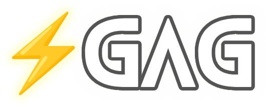
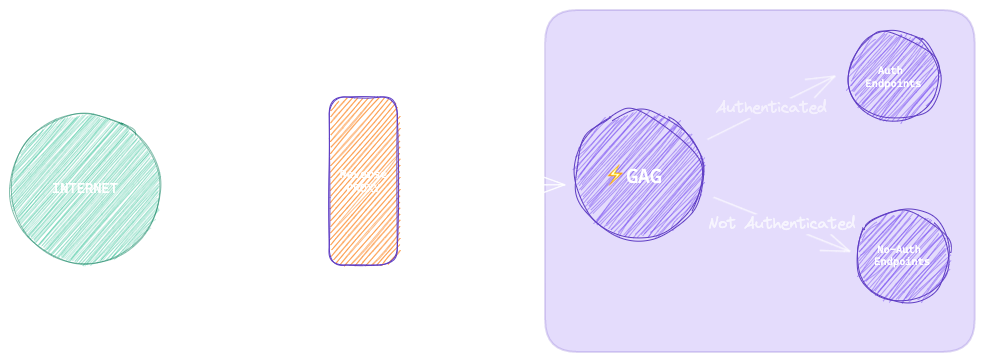

# ⚡️Lightning fast GO API Gateway(GAG) for JWT based Authentication
<div align="center">
    
</div>

Welcome to the Lightning Fast GO API Gateway (GAG) repository, completely written in GO ! This repository provides a blazing-fast API gateway solution for managing microservices communication with JWT-based authentication. GAG supports various algorithms for JWT decoding, including RSA, and seamlessly integrates both gRPC and HTTP for efficient microservice communication.
<div align="center">
    
</div>

## Table of Contents

1. [Introduction](#introduction)
2. [Current Development](#current-development)
3. [Scope of Work](#scope-of-work)
4. [Future Work](#future-work)
5. [Building and Running](#building-and-running)
6. [License](#license)

## Introduction

API gateways play a crucial role in modern microservices architectures by providing a single entry point for managing communication between services. The Lightning Fast GO API Gateway (GAG) is designed to offer high performance, flexibility, and security for microservice environments. With support for JWT-based authentication, GAG ensures secure communication between services while maintaining lightning-fast response times.

## Current Development

At the current stage of development, GAG offers the following features:

- **JWT Authentication**: GAG supports JWT-based authentication, allowing secure communication between microservices. It can decode JWT tokens using RSA and other algorithms.
  
- **Blazing-Fast Performance**: Leveraging the power of Go programming language, GAG delivers exceptional performance, ensuring minimal latency in microservice communication.
  
- **gRPC and HTTP Support**: GAG seamlessly integrates both gRPC and HTTP protocols, providing flexibility in communication between microservices based on their specific requirements.
  
- **Configurability**: GAG is highly configurable, allowing users to customize authentication mechanisms, routing rules, and other parameters according to their needs.

## Scope of Work

The current scope of work for GAG includes:

- [x] Implement JWT-based authentication with RSA decoding.
  
- [x] Support both gRPC and HTTP protocols for microservice communication.
  
- [x] Ensure high performance and low latency for API gateway operations.
  
- [x] Provide configuration options for fine-tuning gateway behavior.

## Future Work

In the future, we plan to enhance GAG with the following features:

- [ ] Support for additional JWT decoding algorithms (e.g., HMAC, ECDSA).
  
- [ ] Implement rate limiting and throttling capabilities for improved security and resource management.
  
- [ ] Integrate with monitoring and logging solutions for enhanced observability.
  
- [ ] Develop comprehensive documentation and examples for easier adoption and integration.

## Building and Running

To build and run GAG, follow these instructions:

Generate keys
```
ssh-keygen -t rsa -b 4096 -m PEM -f jwtRS256.key
# Don't add passphrase 
openssl rsa -in jwtRS256.key -pubout -outform PEM -out jwtRS256.key.pub

```

1. **Building from Source**

   - Ensure you have Go installed. If not, you can download it from [here](https://golang.org/doc/install).
   - Clone this repository:

     ```bash
     git clone https://github.com/codebreaker444/gag.git
     ```

   - Navigate to the cloned repository:

     ```bash
     cd gag
     ```

   - Build the binary:

     ```bash
     go build -o gag main.go
     ```

2. **Running the Binary**


   - Once you have built the binary, you can run it with the following command:

     ```bash
     ./gag [arguments]
     ```

   - Replace `[arguments]` with the necessary arguments for configuring GAG. You can refer to the documentation or help command for details on available arguments and their usage.

## License

The Lightning Fast GO API Gateway (GAG) is licensed under the [MIT License](LICENSE). You are free to use, modify, and distribute this software for any purpose, subject to the terms of the license.

---

Thank you for considering the Lightning Fast GO API Gateway (GAG) for your microservices architecture. We welcome contributions, feedback, and suggestions to make GAG even better! If you have any questions or ideas, please don't hesitate to reach out to us.
